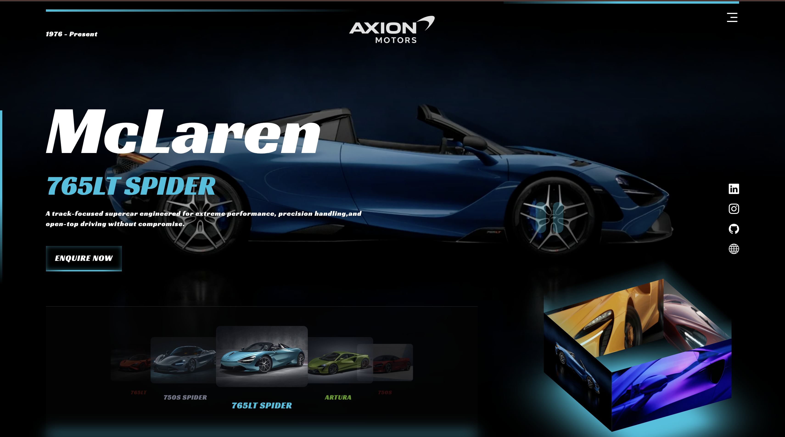
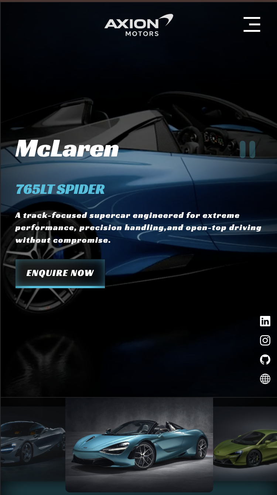

# AXION Motors - Automobile Brand Website


A stunning, fully responsive automobile brand website showcasing McLaren supercars with immersive video backgrounds, 3D animations, and modern UI design.

---

## 🚗 Live Demo

[View Live Demo](https://axion-motors.vercel.app/) 

---

## 📋 Table of Contents

- [Features](#-features)
- [Pages](#-pages)
- [Technologies Used](#-technologies-used)
- [Project Structure](#-project-structure)
- [Installation](#-installation)
- [Usage](#-usage)
- [Customization](#-customization)
- [Screenshots](#-screenshots)
- [Contributing](#-contributing)
- [License](#-license)
- [Contact](#-contact)

---

## ✨ Features

### Core Features
- **Immersive Video Backgrounds** - Full-screen auto-playing videos for each car model
- **3D Rotating Cube** - CSS 3D transforms creating an animated video cube display
- **Interactive Carousel** - Materialize CSS powered car selection carousel
- **Smooth Animations** - CSS keyframe animations and transitions throughout
- **Responsive Design** - Fully optimized for desktop, tablet, and mobile devices

### Interactive Elements
- **Dynamic Video Switching** - Click on carousel items to change background videos
- **Play/Pause Controls** - Control video playback with elegant UI buttons
- **Lightbox Gallery** - Full-screen image viewer with keyboard navigation
- **Filter System** - Filter cars by category (SuperCars, GT, Ultimate, Legacy)
- **Animated Statistics** - Number counter animations on scroll
- **Contact Form** - Functional contact form with validation

### Design Highlights
- **Glassmorphism Effects** - Modern frosted glass UI elements
- **Gradient Overlays** - Stunning visual depth with gradient backgrounds
- **Custom Scrollbar** - Styled scrollbar matching the theme
- **Hover Effects** - Interactive hover states on all clickable elements
- **Neon Glow Effects** - Cyan/teal accent color with glow effects

---

## 📄 Pages

### 1. Home Page (`index.html`)
- Hero section with video background
- 3D rotating video cube
- Car model carousel
- Social media links
- Play/pause video controls

### 2. All Models (`models.html`)
- Grid layout of all car models
- Filter by category buttons
- Car specifications (speed, horsepower, 0-60 time)
- Pricing in Indian Rupees (₹)
- Hover effects with "View Details" overlay

### 3. Model Detail (`model-detail.html`)
- Full-screen hero video
- Dynamic content based on URL parameters
- Technical specifications grid
- Key features section
- Image gallery
- Call-to-action buttons

### 4. About Us (`about.html`)
- Company story section
- Animated statistics counter
- Core values cards
- Leadership team profiles
- Company timeline/history

### 5. Gallery (`gallery.html`)
- Masonry grid layout
- Filter by category (Exterior, Interior, Track, Videos)
- Lightbox image viewer
- Video playback support
- Keyboard navigation (Arrow keys, Escape)

### 6. Contact (`contact.html`)
- Contact form with validation
- Location information cards
- Business hours
- Google Maps embed
- Multiple contact methods

---

## 🛠 Technologies Used

### Frontend
| Technology | Purpose |
|------------|---------|
| HTML5 | Semantic markup structure |
| CSS3 | Styling, animations, 3D transforms |
| JavaScript (ES6+) | Interactivity and DOM manipulation |

### Libraries & Frameworks
| Library | Version | Purpose |
|---------|---------|---------|
| [Materialize CSS](https://materializecss.com/) | 1.0.0 | Carousel component |
| [Bootstrap Icons](https://icons.getbootstrap.com/) | 1.11.1 | Icon library |
| [Google Fonts](https://fonts.google.com/) | - | Racing Sans One, Roboto fonts |

### Design
- **Primary Color**: `#00c2de` (Cyan/Teal)
- **Background**: Dark theme with gradients
- **Font Family**: Racing Sans One (headings), Roboto (body)

---

## 📁 Project Structure

```
Automobile-Brand-Website/
├── index.html              # Homepage
├── models.html             # All models page
├── model-detail.html       # Individual model details
├── about.html              # About us page
├── gallery.html            # Image & video gallery
├── contact.html            # Contact page
├── style.css               # Main stylesheet
├── pages.css               # Styles for inner pages
├── main.js                 # JavaScript functionality
├── README.md               # Project documentation
├── favicon.ico             # Browser favicon
└── assets/
    ├── image/
    │   ├── logo.png        # Company logo
    │   ├── fav.jpg         # Favicon image
    │   ├── menu-3-fill.png # Menu icon
    │   ├── close-line.png  # Close icon
    │   ├── mclaren-1.jpg   # 765LT Spider image
    │   ├── mclaren-2.jpg   # Artura image
    │   ├── mclaren-3.jpeg  # 750S image
    │   ├── mclaren-4.jpeg  # 765LT image
    │   └── mclaren-5.jpeg  # 750S Spider image
    └── videos/
        ├── mclaren-1.mp4   # 765LT Spider video
        ├── mclaren-2.mp4   # Artura video
        ├── mclaren-3.mp4   # 750S video
        ├── mclaren-4.mp4   # 765LT video
        ├── mclaren-5.mp4   # 750S Spider video
        ├── trailer-1.mp4   # Trailer video 1
        ├── trailer-2.mp4   # Trailer video 2
        └── trailer-3.mp4   # Trailer video 3
```

---

## 🚀 Installation

### Prerequisites
- A modern web browser (Chrome, Firefox, Safari, Edge)
- A local development server (optional but recommended)

### Steps

1. **Clone the repository**
   ```bash
   git clone https://github.com/ZoroDev0/Axion-Motors.git
   ```

2. **Navigate to project directory**
   ```bash
   cd Automobile-Brand-Website
   ```

3. **Open with Live Server**
   
   Using VS Code Live Server extension:
   - Install "Live Server" extension in VS Code
   - Right-click on `index.html`
   - Select "Open with Live Server"

   Or using Python:
   ```bash
   # Python 3
   python -m http.server 3000
   ```

   Or using Node.js:
   ```bash
   npx serve
   ```

4. **View in browser**
   ```
   http://localhost:3000
   ```

---

## 💻 Usage

### Navigation
- Click the **hamburger menu** (☰) to open the navigation
- Use the **carousel** at the bottom to switch between car models
- Click on any car image to change the video background

### Video Controls
- Click the **pause button** (⏸) to pause all videos
- Click the **play button** (▶) to resume playback

### Gallery
- Click **filter buttons** to filter by category
- Click **zoom icon** on images to open lightbox
- Use **arrow keys** (← →) to navigate in lightbox
- Press **Escape** to close lightbox

### Models
- Click **filter buttons** to filter by car category
- Click **"View Details"** to see full specifications
- Click **"Enquire Now"** to contact about a specific model

---

## 🎨 Customization

### Changing Primary Color
Edit the CSS variable in `style.css`:
```css
:root {
  --primary: #00c2de; /* Change this value */
}
```

### Adding New Car Models
1. Add images to `assets/image/`
2. Add videos to `assets/videos/`
3. Update `models.html` with new model card
4. Add model data in `main.js` under the `models` object

### Updating Contact Information
Edit the contact details in `contact.html`:
- Address in `.info-card` sections
- Phone numbers
- Email addresses
- Google Maps embed URL

---

## 📱 Responsive Breakpoints

| Breakpoint | Target Devices |
|------------|----------------|
| `≤1200px` | Tablets & small laptops |
| `≤992px` | Tablets (hides 3D cube) |
| `≤768px` | Mobile devices |
| `≤480px` | Small phones |
| `≤500px height` | Landscape mobile |

---

## 📸 Screenshots

<p align="center">
  <br/>
  <sub><b>Desktop Experience</b> — Cinematic layout with immersive visuals</sub>
</p>

<br/>

<p align="center">
  <br/>
  <sub><b>Mobile Experience</b> — Responsive, fluid, and performance-optimized</sub>
</p>

---

## 🤝 Contributing

Contributions are welcome! Here's how you can help:

1. **Fork the repository**
2. **Create a feature branch**
   ```bash
   git checkout -b feature/AmazingFeature
   ```
3. **Commit your changes**
   ```bash
   git commit -m 'Add some AmazingFeature'
   ```
4. **Push to the branch**
   ```bash
   git push origin feature/AmazingFeature
   ```
5. **Open a Pull Request**

---

## 📜 License

This project is licensed under the MIT License - see the [LICENSE](LICENSE) file for details.

---

## 📞 Contact

**Sasanka** - [@zorodev](https://www.linkedin.com/in/zorodev/)

- 🌐 Portfolio: [sasankawrites.in](https://sasankawrites.in/)
- 📸 Instagram: [@zorodev.exe](https://www.instagram.com/zorodev.exe)
- 💻 GitHub: [@ZoroDev0](https://github.com/ZoroDev0)

### AXION Motors (Fictional)
- 📍 Unit no. 2, Aman Chamber, Swatantryaveer Savarkar Rd, Opp. New Passport Office, Century Bazaar, Prabhadevi, Mumbai, Maharashtra 400025
- 📞 Sales: +91 22 6789 0123
- 📧 info@axionmotors.com

---

## 🙏 Acknowledgments

- [Materialize CSS](https://materializecss.com/) for the carousel component
- [Bootstrap Icons](https://icons.getbootstrap.com/) for the icon library
- [Google Fonts](https://fonts.google.com/) for Racing Sans One & Roboto fonts
- McLaren Automotive for design inspiration

---

<p align="center">
  Made with ❤️ by <a href="https://sasankawrites.in/">Zoro</a>
</p>

<p align="center">
  ⭐ Star this repository if you found it helpful!
</p>
